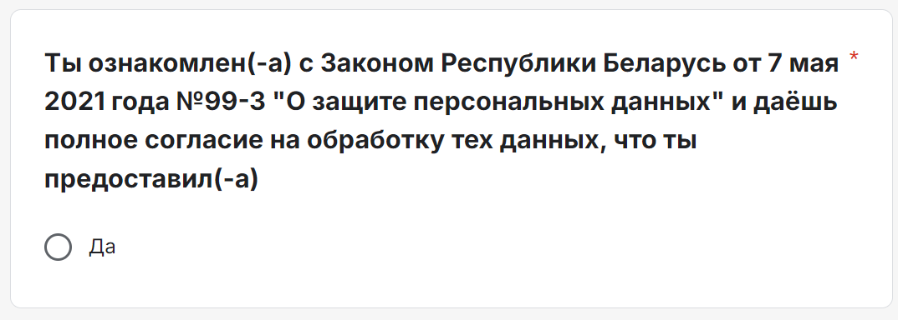

# Общее руководство для стажёров

## Описание

Данный документ содержит информацию, направленную на защиту личных и профессиональных границ, а также инструкции по работе с персональными данными при проведении опросов в рамках учебного сектора. Ознакомьтесь с рекомендациями для обеспечения комфортной и безопасной работы.

## Содержание

- [Общее руководство для стажёров](#общее-руководство-для-стажёров)
  - [Описание](#описание)
  - [Содержание](#содержание)
  - [Гайд по проведению ежемесячных собраний](#гайд-по-проведению-ежемесячных-собраний)
  - [Феномен «Догвилль» и защита личных границ на работе](#феномен-догвилль-и-защита-личных-границ-на-работе)
  - [Правила обработки персональных данных при создании опросов](#правила-обработки-персональных-данных-при-создании-опросов)
    - [Пример текста для подтверждения согласия в Google Forms](#пример-текста-для-подтверждения-согласия-в-google-forms)
    - [Пример вопроса для подтверждения:](#пример-вопроса-для-подтверждения)

---

## Гайд по проведению ежемесячных собраний

- [Гайд по проведению ежемесячных собраний](./monthly-meeting-guide.md)

---

## Феномен «Догвилль» и защита личных границ на работе

Феномен «Догвилль» описывает постепенное нарушение личных и рабочих границ через небольшие уступки. Этот термин широко применяется для описания ситуации, когда сотрудники или коллеги начинают требовать всё больше уступок, которые в конечном итоге становятся нормой.

[Статья на Хабре](https://habr.com/ru/articles/507976/) подробно рассказывает, как такие уступки влияют на рабочую обстановку и как это давление усиливается. В статье даются практические советы, как защитить свои границы.

---

## Правила обработки персональных данных при создании опросов

При создании и распространении опросов важно соблюдать требования Закона Республики Беларусь от 07.05.2021 г. №99-З "О защите персональных данных". Все респонденты должны быть информированы о сборе и обработке их персональных данных и согласиться с условиями.

### Пример текста для подтверждения согласия в Google Forms

*Заполняя данную форму, вы принимаете и соглашаетесь с условиями сбора и обработки персональных данных, согласно Закону Республики Беларусь от 07.05.2021 г. №99-З "О защите персональных данных".*

### Пример вопроса для подтверждения:

С полной версией Закона Республики Беларусь "О защите персональных данных" можно ознакомиться по [ссылке](https://pravo.by/document/?guid=12551&p0=H12100099).
